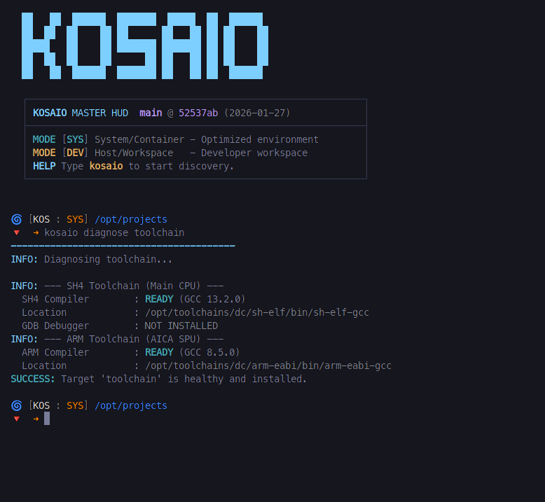

# KOSAIO (KallistiOS All In One)

> **Container-based toolchain and SDK manager for Dreamcast development.**

KOSAIO provides a unified workspace for Dreamcast homebrew development, managing toolchains, libraries, and emulators through containers.



*The KOSAIO Master HUD showing a healthy, ready-to-use cross-compiler environment.*

## Core Features

*   **Integrated Environment**: Comes with KOS and essential tools pre-configured.
*   **Hot Swap Mode**: Switch any tool between Container (system) and Host (workspace) individually with `dev-switch`. Libraries follow a collection-first model via `kos-ports`.
*   **ARM & AICAOS Ready**: Full support for building custom sound drivers with automated ARM toolchain patching.
*   **Smart Dashboard**: Use `kosaio list` to see installed tools and active mode.
*   **Unified Workspace**: Develop on your Host OS while compiling inside the container.
*   **Terminal HUD**: A dynamic prompt showing your current region and system health.

## Included Tools

You can install these tools with kosaio:

| Tool              | Description                                                                                         |
| ----------------- | --------------------------------------------------------------------------------------------------- |
| **KOS**           | KallistiOS, the main open-source SDK for the Sega Dreamcast.                                        |
| **KOS-CHAIN**     | The compiler suite (GCC/Binutils) for SH4 and ARM architectures.                                    |
| **KOS-PORTS**     | Collection of third-party libraries ported to KallistiOS (zlib, libpng, GLdc, etc.).                 |
| **dcaconv**       | Converts audio to a format for the Dreamcast's AICA.                                                |
| **dcload-ip**     | Loads and executes binaries over Ethernet using a Broadband Adapter.                                |
| **dcload-serial** | Loads and executes binaries over a serial "Coders Cable".                                           |
| **makeip**        | Generates 'IP.BIN' boot files for Dreamcast executables.                                            |
| **mkdcdisc**      | Creates self-booting CDI disc images, compatible with emulators and CD-R burning.                    |
| **mksdiso**       | Creates ISO images for SD loaders like GDEmu.                                                       |
| **img4dc**        | Tools for working with Dreamcast disc images (CDI/MDS).                                             |
| **AICAOS**        | Dedicated Operating System for the AICA (ARM7) Sound Chip.                                          |
| **libdreamroq**   | RoQ playback library for Dreamcast.                                                                 |
| **mame**          | Multi-purpose emulation framework (configured for Dreamcast).                                       |
| **SDL2**          | SDL2 kosaio custom build (64-bit, compiles from source to `/opt/kosaio/data/lib/sdl2/64/`).            |
| **SDL2-32**       | SDL2 kosaio custom build (32-bit, for Dreamcast simulation on PC: `PC_SIMULATE_DC=yes`).                |
| **SDL3**          | SDL3 kosaio custom build (64-bit, compiles from source to `/opt/kosaio/data/lib/sdl3/64/`).            |
| **SDL3-32**       | SDL3 kosaio custom build (32-bit, for Dreamcast simulation on PC).                                     |
| **SDL2-DC**       | SDL2 port for Dreamcast by GPF (cross-compiled with KOS toolchain into `${KOS_BASE}/addons`).       |
| **SDL3-DC**       | SDL3 port for Dreamcast by GPF (cross-compiled with KOS toolchain into `${KOS_BASE}/addons`).       |
| **deecy**         | Experimental Dreamcast emulator written in Zig (SH-4 JIT, WebGPU).                                  |
| **flycast**       | High-performance Dreamcast emulator with Vulkan support.                                            |
| **nitrocast**     | Modern, fast Dreamcast emulator (successor to lxdream-nitro).                                       |
| **SGDK**          | Sega Genesis Development Kit (C library & tools). Different platform, but shares the toolchain flow. |

* **KOS-PORTS Library Management**: You can now install individual libraries (like **Sh4zam**, **GLdc**, **SDL**) directly using `kosaio clone kos-ports` and `kosaio install <library>`.
* **SDL Build Customization**: All SDL variants (`sdl2`, `sdl2-32`, `sdl3`, `sdl3-32`, `sdl2-dc`, `sdl3-dc`) accept CMake flags to customize the build. See [SDL Build Configuration](#sdl-build-configuration) below.
* **makeip** is already included in KOS, but this version is more updated.
* **deecy**, **flycast**, **nitrocast** and **mame** emulators compile in the container but run on the host. They require BIOS files installed on the host.
* Dependencies are installed automatically when a tool is requested. If you need to manually refresh them, use `kosaio install-deps system`.
* More tools will be implemented. If you want to contribute, check the `scripts/registry` structure. If you have a tool suggestion, please open an issue!

## Prerequisites

To use KOSAIO, you must have **Podman** or **Docker** installed on your host system. The setup scripts will automatically detect and use either of these container engines.

### Quick Setup (Recommended)
The easiest way to set up your environment is using the assistant script. It will build the image and create the container with the correct volume mounts for local development.

> [!IMPORTANT]  
> Before running the setup, you must create your configuration file:
> 1. Copy `kosaio.cfg.template` to `kosaio.cfg`.
> 2. Edit `kosaio.cfg` and set your projects directory and preferred tool (Docker or Podman).

1.  Make the script executable:
    ```bash
    chmod +x kosaio-setup.sh
    ```
2.  Run the setup:
    ```bash
    ./kosaio-setup.sh
    ```
3.  Enter the environment:
    ```bash
    ./kosaio-shell
    ```

> [!TIP]
> This method mounts your local KOSAIO folder into the container, allowing you to edit scripts on your host and see changes instantly inside Podman/Docker.

### First Steps
The first SDK you need to install is KallistiOS (KOS). It is a long process, so be prepared for a break!

> [!TIP]
> Before installing KOS, you can look at the config files inside the `configs` folder and make adjustments if required (like changing GCC version). For KOS v2, the file is `kos-v2-dreamcast.cfg`; for KOS v3, use `kos-v3-dreamcast.cfg` and `kos-v3-aica.cfg`.

```bash
kosaio install kos
```

> After installing KOS, you don't need to exit! Just run **`kreload`** to activate the new environment and refresh your shell instantly.

Now you are ready to develop a Dreamcast application. You can create a new project from a template:

```bash
kosaio create-project mygame
```

### Diagnostic and Health Checks

KOSAIO provides a powerful diagnosis system to ensure your environment is correctly configured.

*   **System Check**: `kosaio diagnose system` (Checks variable paths and toolchains).
*   **KOSAIO Health**: `kosaio diagnose self` (Checks if KOSAIO scripts are intact and up to date).
*   **SDK-Specific Check**: `kosaio diagnose kos` (Checks if KallistiOS is properly compiled).

KOSAIO offers a granular **Hybrid Mode** for advanced users who want to modify tools like `kos` or libraries like `libGL` directly from their Host OS.

#### Terminology:
- **CONTAINER (System)**: Uses the pre-installed, stable version inside the Docker image.
- **HOST (Workspace)**: Uses the source code and binaries from your local `/opt/projects/kosaio-dev/` folder, visible in the host.

#### Workflow:

1.  **Check Status**:
    ```bash
    kosaio list
    ```
    Shows which mode is active and if the tool is installed in that mode.

2.  **Switch Mode**:
    ```bash
    # Move KOS to your workspace
    kosaio dev-switch kos host
    
    # Refresh the variables and shell UI instantly
    kreload
    ```

3.  **Manage Sources**:
    - `kosaio clone <tool>`: Downloade source code to the host.
    - `kosaio build <tool>`: Compile from source.
    - `kosaio apply <tool>`: Register the built binaries.

4.  **Back to Stable**:
    ```bash
    kosaio dev-switch kos container
    kreload
    ```

### Examples

Some examples of how to use kosaio:

`kosaio install kos`

`kosaio clone kos-ports` # clone kos-ports to the container (recommended)

`kosaio diagnose system`

`kosaio install-deps system`

`kosaio update self`

`kosaio update sh4zam`

#### Advanced Interactive Shell
Enabling the KOSAIO shell provides a series of productivity helpers:
- **`kosaio list`**: Find libraries by name or description.
- **`kcd <project>`**: Fast jump to any project in your workspace.
- **`kreload`**: Hot-swap environment variables & prompt after a `dev-switch`.
- **Hot Actions**: Use `--dev-host` or `--dev-cont` to override mode for a single command.
- **Tab-Completions**: Full support for all `kosaio` commands.

#### Managing KOS-PORTS Libraries

Instead of building all kos-ports libraries, you can install only what you need:

```bash
# List all available libraries
kosaio list

# Get info about a specific library
kosaio info sh4zam

# Install only specific libraries
kosaio install sh4zam
kosaio install libpng zlib

# Update a specific library
kosaio update libgl

# Uninstall a library
kosaio uninstall sh4zam
```

#### SDL Build Configuration

SDL builds are configured by editing the corresponding `.cfg.default` file under `scripts/registry/cfg/`, or by creating a user override:

```bash
# Edit the default configuration for sdl2-dc
kosaio config sdl2-dc

# Rebuild with the new configuration
kosaio build sdl2-dc
```

Use CMake-style `-DSDL_*=ON/OFF` flags. Available options are documented with comments in each `.cfg.default` file.

**Architecture note**: the arch (32 vs 64-bit) is selected by the tool name (`sdl2.tool` = 64-bit, `sdl2-32.tool` = 32-bit) — there is no need to set `-DCMAKE_C_FLAGS=-m32` manually. Use `kosaio build sdl2-32` for 32-bit builds.

#### Using SDL in your own projects

For user projects, kosaio ships a set of `.mk` files under `scripts/registry/mk/` (the path is exposed as the `KOSAIO_MK` env var after sourcing `shell-init.sh`). These provide complete `CFLAGS` / `LDFLAGS` per variant, so the project Makefile only needs to `include` the right one:

```make
# 32-bit (Dreamcast simulation on PC)
include $(KOSAIO_MK)/sdl2-custom-32.mk
SDL2_CFLAGS  := $(SDL2_CUSTOM-32_CFLAGS)
SDL2_LDFLAGS := $(SDL2_CUSTOM-32_LDFLAGS)

# 64-bit (kosaio custom)
include $(KOSAIO_MK)/sdl2-custom-64.mk

# apt (system)
include $(KOSAIO_MK)/sdl2-std.mk

# Dreamcast (KOS)
include $(KOSAIO_MK)/sdl2-dc.mk
```

Available: `sdl2-{std,std32,custom-32,custom-64,dc}.mk`, `sdl3-{custom-32,custom-64,dc}.mk`, `openal-{32,64}.mk`. See [`docs/plan-library-resolver.md`](docs/plan-library-resolver.md) for the full design.

#### Update Behavior: Auto-Stash

Several tools leave the working tree dirty after building or installing — `kos` (toolchain `Makefile.*.cfg` in `utils/kos-chain/`, plus `addons/` and `.kos-manifest/` from addon installs), `kos-ports` (`lib/.kos-ports/`), and addons that deploy into `${KOS_BASE}/addons`. To prevent data loss, `kosaio update <tool>` auto-stashes tracked and untracked changes before pulling, and pops the stash back after.

*   The prompt defaults to **Y** (auto-stash). Press `N` to skip and let the update abort cleanly.
*   If the pop has conflicts (e.g. upstream changed the same file you modified), the stash is left in place and recovery instructions are printed (`git status`, `git stash list`, `git checkout --ours|--theirs <file>`).
*   Set `KOSAIO_AUTO_STASH=false` to disable the feature entirely and keep the previous behavior.
*   Set `KOSAIO_NON_INTERACTIVE=1` to skip the prompt and always auto-stash (useful for CI).

### Direct Access to KOS Utilities
You can execute internal KOS tools directly without adding them to your PATH:

```bash
# Convert textures
kosaio tool pvrtex assets/image.png assets/image.pvr

# Create boot sector
kosaio tool makeip IP.TXT IP.BIN

# Scramble binary
kosaio tool scramble main.bin 1st_read.bin
```
Available tools: `pvrtex`, `vqenc`, `makeip`, `scramble`, `bin2o`, `wav2adpcm`, `kmgenc`, `dcbumpgen`.


### Advanced Documentation

For detailed technical information:

- **[Architecture](docs/ARCHITECTURE.md)** - System design, SSoT principles, and directory structure.
- **[Development Workflow](docs/DEVELOPMENT_WORKFLOW.md)** - Hybrid mode guide (Host vs Container).
- **[Terminal HUD](docs/TERMINAL_HUD.md)** - Details about the interactive shell prompts.
- **[Contributing](docs/INDEX.md)** - Documentation index and contributing guidelines.
- **[Future Ideas](docs/FUTURE_IDEAS.md)** - List of candidate tools and libraries for future integration.

### Debugging (Work in Progress, not ready yet)

This setup is designed to support debugging both on real hardware and with the Flycast emulator. The GDB client (`sh-elf-gdb`) always runs inside the container, while the GDB server runs on the target (either the Dreamcast itself or Flycast on your host machine).

-   **Flycast (Emulator)**: Since Flycast is a GUI application, it's best to run it on your host OS, not inside the container.
-   **Real Hardware (dcload-ip)**: dcload-ip from the container to the hardware.
-   **Real Hardware (dcload-serial)**: dcload-serial from the container to the hardware.

### TODO

- [ ] Refine the debugging workflow to be even more seamless.

---

### [Legal Disclaimer & Notices](DISCLAIMER.md)
*Dreamcast and SEGA are trademarks of SEGA Corporation. This project is AI-assisted and not affiliated with SEGA.*
